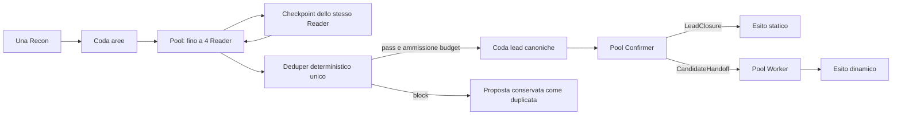

# Run globale concorrente e prima esecuzione BookStack

Data: 2026-10-04. Stato: implementazione applicata e verificata offline; run agentica BookStack non avviata.

## Esito dell'implementazione

Il coordinatore globale e i launcher Python/Laravel/web applicano i pool 4 Reader, 4
Confirmer e 2 Worker, reader checkpoint obbligatorio, deduper deterministico unico,
cap Reader aggregato e Worker da 1M EP. Sessioni, toolbox, accounting live e report sono
isolati per scope. Test offline con barriere verificano overlap, deduplica, refill,
completamento downstream dopo stop Reader, guasti locali, cancellazione e persistenza.
I test mirati dei launcher/web (61 PHP) sono passati; compilazione del form Vue verificata.

Immagine costruita: `lailaps-pentest-agent:global-concurrent-20261004`, nuovo default del
launcher. BookStack e' al commit previsto; agent-view materializzata senza seed, manifest
validati (2 manifest, 3 casi). Preflight runtime con DB/web sani, fixture installata,
`GET /login` 200 e pagina protetta leggibile tramite API editor 200 con baseline prevista.
Container, volumi e rete temporanei del preflight sono stati rimossi.

Il primo lancio ordinario ha superato il precedente blocco dei pool rete, ma ha selezionato
il `docker-compose.yml` upstream (app/node/mailhog/mysql), invece del `compose.yml` harness.
Correzione: `BenchmarkRun` sceglie il compose dall'overlay e passa `--compose` esplicitamente
a `pentest:run`, evitando collisioni con file di sviluppo presenti nel runtime materializzato.
25 test mirati launcher/Compose passati, inclusa la regressione con entrambi i file presenti.
Il profilo BookStack controlla l'API prima di `/login`: il cookie anonimo creato dal login
prevale sul token API nel middleware BookStack e causava 403 nel client readiness condiviso.
La verifica del launcher usa Docker reale e sostituisce soltanto `runAgent` con uno stub,
senza chiamate modello o report artificiale; il punteggio benchmark risulta quindi incompleto.
Preflight effettivo riuscito: `bookstack-launcher-preflight-20261004-200455` seleziona
`runtime/compose.yml`, servizio `bookstack-web`, readiness/database/probe fixture verificati,
arriva a `runAgent` sostituito dallo stub e supera la readiness post-run.
Sandbox di prova smontata con `--keep=false`; nessuna chiamata ai modelli.

Verifica aggiuntiva: 54 test executor/runtime passati. La suite legacy `test_model_trace`
ha ancora un'aspettativa obsoleta sul file `model-tool-trace.jsonl`, la cui scrittura
e' gia' disabilitata nel runtime preesistente; non e' un failure della pipeline globale.

Le sezioni seguenti conservano requisiti e sequenza del piano originale.

## Obiettivo e perimetro P0

Allineare `--global` a una Recon per pass, fino a quattro Reader concorrenti sulle aree, checkpoint autonomi del Reader, deduplica deterministica centralizzata e Confirmer/Worker avviati durante la discovery. Il cap Reader ferma nuove esplorazioni e nuove ammissioni; le lead già ammesse continuano indipendentemente. Portare il budget iniziale Worker a 1.000.000 EP e rendere eseguibile la prima run completa su BookStack.

Il lavoro riguarda il percorso globale ordinario e quello `benchmark:run --global`, attraverso lo stesso orchestratore Python. Il benchmark Reader-only resta un benchmark, non diventa il motore della run completa. Preservare le modifiche preesistenti del checkout.

## Comportamento finale



Il pool Reader è a riempimento continuo: appena uno slot si libera prende un'altra area, senza attendere la fine degli altri tre Reader. Una lead non termina l'area né sospende il Reader in attesa del downstream. Confirmer e Worker hanno pool indipendenti e possono sovrapporsi ai Reader e tra loro su lead diverse. Per la stessa lead resta obbligatorio l'ordine Reader → deduper → Confirmer → Worker.

Default proposti: 4 Reader, 4 Confirmer e 2 Worker. I due slot Worker sono un limite di concorrenza, non di finding totali: una run può confermare più di due candidate. Il limite è configurabile.

## Evidenze nel codice attuale

- `multi_category.py::_run_global_surface_pass` crea oggi un unico `TripleAgentOrchestrator` sequenziale.
- `triple_agent.py::run` attende `_refine`; `_refine` attende `_confirm`. La discovery riparte dopo il downstream.
- `Deps` contiene stato mutabile per ruolo e lead attivi, history indiretta, cookie, source reference, sessioni e telemetria: non può essere condiviso integralmente tra task concorrenti.
- `ArtifactStore.child()` condivide lo stesso outcome e scope: non crea directory isolate. Scrivere report locali da più figli sovrascriverebbe il report del pass anche con scritture atomiche.
- Il `DeterministicDeduper` esiste già e si può riusare, ma l'indice deve essere unico per il pass, non uno per Reader.
- `reader_checkpoint` esiste, ma i default dei launcher sono ancora `reviewer`; `_review_tranche` usa ancora il Reviewer per `AreaEnrichmentLead`.
- Il loop può marcare una lead appena acquisita `unfunded` quando finisce la discovery, prima dell'ammissione Confirmer.
- Il broker distingue già gli stage per lead, ma il pool discovery include Recon e Reader. L'accounting del ruolo è consolidato in `_run_role_once`: non basta per controllare quattro sessioni contemporaneamente senza contabilizzare anche il consumo in corso.
- Worker ha oggi un default di 3.000.000 EP, con documentazione e test che contengono valori precedenti o hardcoded.

Questi sono i punti da correggere; non serve riprogettare i contratti model-facing.

## 1. Coordinatore del pass e sessioni isolate

Introdurre un coordinatore globale Python piccolo, chiamato da `_run_global_surface_pass`, con `asyncio.Queue` e task concorrenti nello stesso processo. Riutilizzare le primitive del loop esistente; estrarre soltanto i confini necessari per avviare un Reader su un'area e una conferma su una lead. Evitare di duplicare l'intero `triple_agent.py`.

Il coordinatore possiede Area Ledger globale, registro canonico delle lead, deduper, broker del pass, code e report aggregato. Ogni Reader ha un solo assignment attivo, `Deps`, history/provider session e telemetria propri. Ogni lead downstream ha `Deps`, HTTP/cookie jar, auth bindings, evidenze e conversazioni propri; Confirmer e Worker della stessa lead possono riusare questo contesto in sequenza. La sessione Worker rimane fresh per candidate.

Condividere il sorgente e l'indice Codebase Memory. Verificare la concorrenza dei client/esecutori esistenti: usare handle locali quando mantengono stato di sessione, e spostare fuori dall'event loop soltanto le operazioni bloccanti effettivamente coinvolte. Non chiudere un client condiviso quando termina un figlio.

Qualificare ID di lead, output e source reference con pass e scope del figlio, usando le convenzioni di provenance esistenti. Consegnare ai figli copie/snapshot espliciti del contesto necessario; non usare `deepcopy` di client, lock o browser.

Il coordinatore è l'unico publisher del report del pass. Riutilizzare i publisher di `ArtifactStore` per acquisire gli aggiornamenti dei figli e ricostruire l'aggregato; non far pubblicare il report locale di un agente come se fosse il report globale. Notebook ed evidence ledger continuano a usare le primitive esistenti con scope e ID corretti.

## 2. Reader checkpoint e assenza del Reviewer globale

La run globale risolve sempre `reader_checkpoint` e `deduper_mode=deterministic`. Risolvere questa policy una volta e propagarla fino ai figli; non mutare `settings` tra task. Opzioni globali esplicitamente incompatibili devono dare un errore chiaro invece di cambiare silenziosamente architettura. Il percorso legacy non globale resta fuori da questo intervento.

- Tranche, continuazione e chiusura dell'area vengono decise dal checkpoint dello stesso Reader, usando i contratti piatti già disponibili.
- Nessuna chiamata a Exploration Reviewer o Lead Novelty Reviewer, nemmeno per enrichment, recovery o fallback.
- Per `AreaEnrichmentLead`, il Reader espone già la motivazione: il coordinatore verifica source reference e locator, normalizza la proposta e accoda l'area. Riutilizzare la normalizzazione deterministica esistente; eliminare duplicati esatti di assignment senza inventare una nuova deduplica semantica delle aree.
- Una chiusura riguarda solo l'area assegnata. Il coordinatore decide quando non restano aree da esplorare; il Reader locale non può terminare l'intero pass.
- Gli esiti downstream vengono consegnati all'eventuale Reader ancora attivo come aggiornamenti bounded, senza attenderli per proseguire e senza riaprire automaticamente un'area già chiusa.

Confirmer e Worker mantengono i loro self-checkpoint attuali. La telemetria globale deve mostrare zero richieste e zero EP del ruolo Reviewer; la compressione tecnica delle history continua secondo il meccanismo esistente.

## 3. Deduper prima del Confirmer e dispatch immediato

Ogni `ReaderLead`, comprese quelle emesse al checkpoint, passa da una sola procedura nel coordinatore:

1. Validare il contratto e le source reference; conservare proposta e origine.
2. Qualificare gli ID e invocare il `DeterministicDeduper` unico del pass.
3. Su `block`, registrare il duplicato e il rappresentante: nessun funding o Confirmer.
4. Su `pass`, verificare che l'ammissione Reader sia aperta, registrare la lead canonica, ammettere il budget Confirmer e accodarla immediatamente.

Questa sezione deve essere atomica rispetto alle altre proposte. Un lock breve sul coordinatore è sufficiente; nessun lock deve restare acquisito durante una chiamata al modello. Riusare la gestione degli inserimenti provvisori del deduper se la registrazione fallisce.

Il deduper resta conservativo: un'identità incompleta non dimostra un duplicato e segue l'attuale comportamento `pass` con motivo diagnostico. Non bloccare arbitrariamente lead valide per l'assenza di campi opzionali.

Un Worker viene accodato non appena è acquisito il `CandidateHandoff`, senza aspettare la conclusione di altri Confirmer. Il dispatch è unico per ID canonico; notifiche ripetute non sbloccano un secondo envelope né avviano un secondo agente.

## 4. Budget e stop della discovery

| Voce | Valore proposto | Regola |
|---|---:|---|
| Recon | Limite attuale, 640.000 EP | Una sola Recon; distinto dal cap Reader |
| Reader | 3.000.000 EP base per pass | Somma di tutti i Reader, inclusi checkpoint e retry |
| Confirmer | 500.000 EP iniziali per lead | Sbloccati solo dopo deduper e ammissione canonica |
| Continuazione Confirmer | 250.000 EP per tranche | Mantiene self-checkpoint e ammissione attuali |
| Worker | 1.000.000 EP per handoff | Envelope totale, non rinnovato da checkpoint o nuove tranche |
| Sicurezza del pass | Cap attuale, 100.000.000 EP | Include tutti i ruoli e gli impegni finanziati |

Il cap Reader è separato dal consumo Confirmer/Worker. L'override esplicito Reader prevale sul preset; senza override i moltiplicatori `small/regular/big/huge` si applicano una sola volta alla base Reader, non per area né per slot. Recon non consuma il cap Reader.

Riusare `BudgetBroker`, aggiungendo la vista Reader aggregata e il consumo delle richieste in corso. Un solo accounting autorevole deve includere le risposte di tutti gli agenti, checkpoint, retry e compressioni, senza doppio addebito tra aggiornamenti live e saldo di fine ruolo. L'ammissione delle richieste deve tenere conto degli impegni downstream e delle richieste concorrenti già in corso; non affidarsi al saldo di un solo figlio. Verificare il percorso streaming e quello non streaming.

Al raggiungimento del cap Reader il coordinatore registra `reader_budget_exhausted` e chiude discovery e ammissione di nuove lead. Non avvia altri assignment, richieste Reader o checkpoint terminali obbligatori. Può fermare immediatamente i Reader.

Il confine è l'acquisizione autorevole della lead: una lead validata, deduplicata e ammessa prima dello stop continua, anche se è ancora in coda e non ha un Confirmer attivo. Un output grezzo/non ancora ammesso o arrivato dopo lo stop viene conservato con motivo `not_admitted_reader_budget`; non si avvia un nuovo downstream. La serializzazione degli eventi rende questo ordine verificabile nei casi simultanei. Le richieste già inviate possono avere un consumo finale oltre soglia: registrarlo esplicitamente, senza iniziare una nuova ondata.

La fine del budget Reader non imposta `hard_stop` sui contesti downstream, non termina il ledger globale, non chiude browser/HTTP dei figli e non cancella i task Confirmer/Worker. Gli envelope già ammessi restano disponibili; un CandidateHandoff può sbloccare Worker anche quando il residuo Reader è zero.

Il cap totale e i limiti degli stage restano vincoli distinti: la garanzia riguarda l'esaurimento Reader, non una rimozione del cap totale. Un diniego dovuto al cap totale deve essere attribuito esplicitamente al cap totale, non alla discovery. Il coordinatore dà precedenza all'ammissione downstream pronto rispetto a nuovi assignment Reader quando il budget totale si restringe.

Portare `worker_stage_point_limit` a 1.000.000 EP nella configurazione centrale e allineare `.env.example`, README e test interessati. Un envelope esplicito del benchmark isolato continua a prevalere. Checkpoint, terminalizzazione, retry e compressione Worker fanno parte dello stesso envelope; una nuova tranche non lo rinnova.

## 5. Configurazione e launcher

Esporre e propagare attraverso Python CLI, `pentest:run`, `benchmark:run --global` e avvio audit web:

- `--reader-concurrency=4`;
- `--confirmer-concurrency=4`;
- `--worker-concurrency=2`;
- `--reader-points=<EP>` come override del cap Reader aggregato;
- `--worker-points=<EP>` come override dell'envelope Worker, default centrale 1.000.000.

Validare punti positivi e concorrenza intera positiva; per il P0 Reader ammette da 1 a 4 slot. Non collegare il numero di slot a un limite sul numero totale di lead.

Aggiornare `StoreAuditRunRequest`, `AuditCommandBuilder` e il minimo necessario nel form per non salvare/propagare il vecchio default `reviewer`. La UI non deve proporre il Reviewer per la nuova run globale. Il report registra configurazione risolta, modelli effettivi e concorrenza: gli override non possono restare solo nei comandi shell.

Aggiornare `ARCHITECTURE.md` durante l'implementazione, quando descriverà il comportamento realmente presente. Questo piano non sostituisce la fotografia attuale dell'architettura.

## 6. Fine run, evidenze e guasti

Distinguere la discovery dalla vita della pipeline. Dopo lo stop Reader, il pass resta attivo finché code e task downstream ammessi sono esauriti. Solo allora pubblicare l'outcome finale e liberare le risorse.

Il report deve distinguere discovery esaurita/incompleta, downstream concluso, failure tecnici e cancellazione. Non dichiarare copertura completa se restano aree inesplorate, anche quando tutte le lead ammesse hanno un esito. Le lead non ammesse non diventano finding confermati né sospetti già validati.

Conservare conteggi delle proposte grezze, duplicati, lead canoniche ammesse, non ammesse per budget, LeadClosure, CandidateHandoff e outcome Worker secondo le categorie esistenti. Rendere attribuibili timestamp di spawn/output, EP per ruolo e per lead, stato delle code e motivo di stop. Servono a verificare la sovrapposizione reale, senza introdurre una nuova dashboard.

Un errore locale di un Reader o di una lead deve essere registrato e non cancellare le altre conferme già ammesse. Un guasto irreversibile di persistenza o una cancellazione esplicita termina la run, raccoglie i task e pubblica il checkpoint disponibile. Un esaurimento normale Reader non deve attivare il comportamento di cancellazione globale di una task group.

## Ordine degli interventi e verifiche offline

1. Separare ownership di sessioni, ID, budget e pubblicazione; introdurre i punti di yield del loop. Verificare isolamento e aggregazione prima del fan-out.
2. Implementare il coordinatore e i tre pool, prima con concorrenza 1 e poi con quattro Reader; innestare deduper e dispatch mentre Reader continua.
3. Applicare Reader checkpoint a tutti i percorsi globali, compreso enrichment, e rimuovere le chiamate Reviewer da quel percorso.
4. Implementare cap Reader aggregato, stop dell'ammissione e completamento downstream; allineare il budget Worker a 1M.
5. Propagare parametri nei launcher, outcome e UI minima; aggiornare README e ARCHITECTURE.
6. Verificare sandbox BookStack e preparare il comando della prima run.

Usare agenti fake e barriere/eventi, senza chiamate API o loop agentici a pagamento. Integrare le suite esistenti per budget, triple-agent, multi-category, deterministic deduper, artifact e launcher; aggiungere una suite mirata del coordinatore soltanto per il comportamento nuovo. Casi di accettazione necessari:

- Quattro Reader attivi su aree distinte; il quinto parte quando si libera uno slot senza aspettare gli altri tre.
- Un Reader produce una lead; il Confirmer parte mentre quel Reader prosegue e un altro Reader è ancora attivo. Il Worker parte appena arriva il suo handoff mentre discovery e un altro Confirmer proseguono.
- Due Reader propongono contemporaneamente lo stesso anchor: un solo Confirmer e un solo envelope canonico; una proposta distinta viene preservata.
- Zero chiamate Reviewer, inclusi enrichment e recovery. Checkpoint e chiusura non operano sull'area di un altro slot.
- Esaurimento Reader con lead già in coda, Confirmer attivo e Worker attivo: niente nuove ammissioni, ma tutti i downstream ammessi possono concludere. Un handoff successivo allo stop Reader può ancora avviare Worker.
- Output tardivo dopo stop: proposta conservata e nessun Confirmer. Consumo delle richieste in corso contabilizzato una sola volta; nessuna nuova ondata dopo lo stop.
- Worker usa 1M complessivo anche attraversando checkpoint, retry e compressione; stage e cap totale non vengono moltiplicati per pool o area.
- Cookie, auth, source reference, evidence, browser e report non si contaminano tra lead. Aggiornamenti simultanei non perdono outcome o notebook.
- Failure locale non cancella il resto; cancellazione globale raccoglie i task e chiude correttamente le risorse. I pass `depth` rimangono isolati e sequenziali.
- Il comando web e quello benchmark propagano gli stessi valori; il report conserva provenienza e valutazione contro tutti i manifest BookStack.

## Prima run BookStack

Il target esistente è BookStack v26.05.3, commit `e1cd3229966d939a75a74a2224ff0643d8af337b`. La validazione statica ha verificato due manifest, con tre casi. Questa non equivale alla readiness HTTP della sandbox.

Dopo i test offline: materializzare sorgente agent-view e runtime tramite `BenchmarkAuditSource`; preparare la sandbox BookStack con compose e profilo esistenti; verificare `/login`, attori, pagina protetta/area modificabile e probe fixture previsti. Il sorgente mostrato agli agenti deve restare separato da manifest, oracle, seed e secret. Usare sandbox e run ID nuovi senza interferire con le run Cacti attive.

Controllare che timeout dell'agente e TTL della sandbox consentano anche il completamento downstream dopo lo stop Reader. Il solo `--ttl` non estende il timeout del processo agente. La prima prova usa depth 1, rebuild dell'immagine aggiornata, cap Reader ridotto ed envelope Worker completo.

Comando previsto dopo l'implementazione delle nuove opzioni:

```powershell
php artisan benchmark:run bookstack --global --depth=1 --reader-checkpoint-strategy=reader_checkpoint --reader-concurrency=4 --confirmer-concurrency=4 --worker-concurrency=2 --reader-points=1000000 --worker-points=1000000 --tool-output --test --keep=true
```

Il cap Reader da 1M è proposto per la prima prova; non è una stima della copertura completa di BookStack. Nel log verificare una sola Recon, overlap reale degli agenti, deduper prima di ogni Confirmer, zero Reviewer e chiusura del report solo dopo il downstream. Una prova senza lead non dimostra il dispatch live; la prova offline con barriere resta obbligatoria.

Questo task consegna il piano. L'implementazione e la run agentica sono i passaggi successivi; non avviare la run come test automatico del piano.

## P1+ esclusi

- Resume dopo crash del processo con ripartenza dei task dal ledger.
- History unica tra candidate Worker e riuso delle sessioni tra lead diverse.
- Scheduling adattivo e priorità semantiche tra lead.
- Deduplica semantica delle aree e persistenza di un nuovo sistema di code.
- Cleanup generale dei contratti e percorsi legacy Reviewer non globali.

Non sono necessari per la prima run globale con questa architettura.
